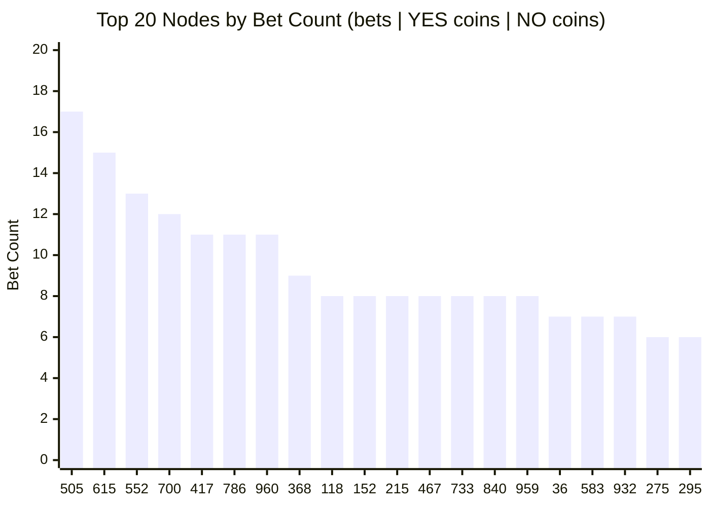
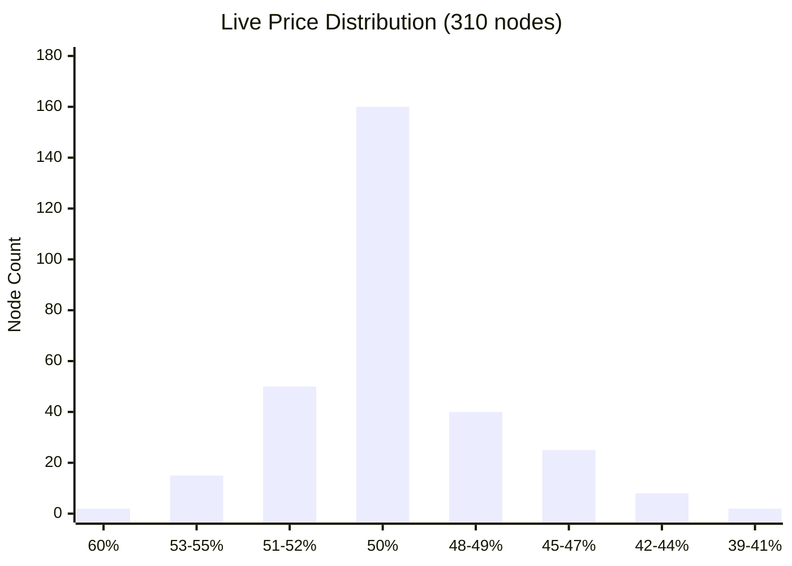
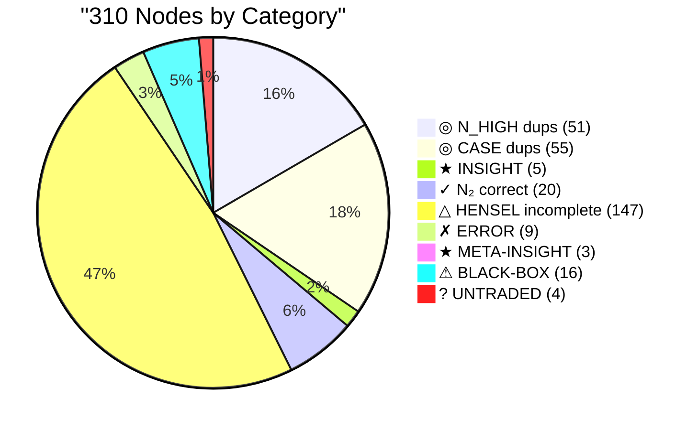
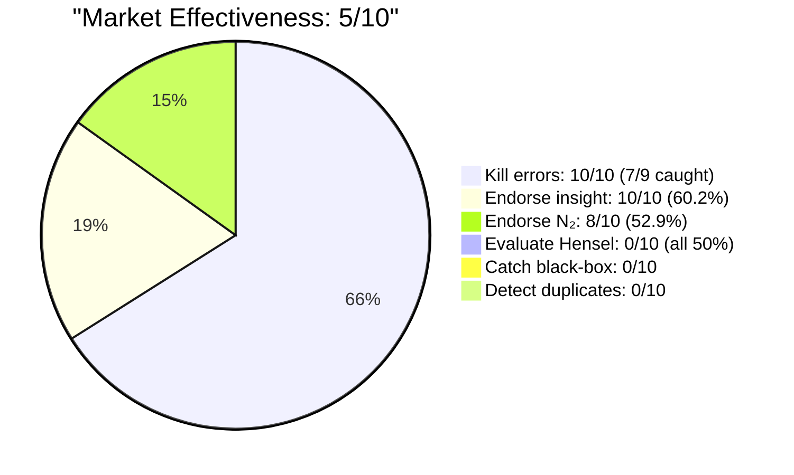

# AIME 2025 I P15 Run 15 (vGaia) — Visualized DAG

**310 nodes | 1000 tx | 641 bets | 8 OMEGA failures | Answer: 735 (never reached)**

Color key: 🟢 Correct | 🔵 Insight | ⬜ Duplicate | 🟡 Incomplete | 🔴 Error | 🟠 Black-box

## Main DAG: Proof Progression + Market Pricing

```mermaid
flowchart LR
    subgraph T1["N_HIGH = 19683\n51 nodes, all ✓"]
        NH["✓ N_high = 27³\n51 nodes (50%)\n96% redundant\n5+ agents agree"]:::correct
    end

    subgraph T2["CASE FRAMEWORK\n57 nodes, 2 ★"]
        CF["◎ 3-adic decomp\n55 duplicates (50%)"]:::dup
        I2a["★ tx_70b [A3] 50%\nv₃(x³-ε)=v₃(x-ε)+1\nHensel lift lemma"]:::insight
        I2b["★ tx_75 [A3] 50%\nN_k=2·3^{5-k}\ncounting formula"]:::insight
    end

    subgraph T3["N₂ = 157464\n20 nodes, ✓ consensus"]
        N2["✓ tx_505 [A10]\n52.9% BULL\nB=17 (120Y/40N)\n★★ HOTTEST"]:::correct
        N2b["✓ tx_48,85,176\n52% BULL each\nindep verification"]:::correct
        N2c["◎ +15 dups\n(50%)"]:::dup
    end

    subgraph T4["HENSEL LIFTING\n147 nodes, all △"]
        HL["△ 147 attempts\nall (50%) flat\nNONE completed\nmod 3→...→2187"]:::partial
        I4["★ tx_368 [A5]\n53.1% BULL B=9\nf(7)=729·f(4)\nbest N₁ idea"]:::insight
        I4b["★ tx_456 [A0]\n50%\npaired cubes"]:::insight
    end

    subgraph T5["ERRORS\n9 nodes, 7 killed"]
        E1["✗ tx_552 [A8]\n42.6% BEAR\nB=13 (0Y/160N)\n486²=WRONG"]:::error
        E2["✗ tx_700 [A11]\n39.0% BEAR\nB=12 (0Y/250N)\nLOWEST PRICE"]:::error
        E3["✗ tx_583 [A5]\n42.4% BEAR"]:::error
        E4["✗ tx_417 [A14]\n44.6% BEAR"]:::error
        E5["✗ tx_19 [A0]\n50% ESCAPED\nv₃(a-1) wrong var"]:::errorhidden
        E6["✗ tx_526 [A2]\n50% ESCAPED"]:::errorhidden
    end

    subgraph T6["META-INSIGHT\n3 nodes ★★★"]
        M1["★ tx_615 [A14]\n60.2% BULL\nB=15 (230Y/0N)\n★★★ HIGHEST\n15 unanimous YES\nerror-detection"]:::insight_peak
        M2["★ tx_786 [A13]\n60.2% BULL\nB=11 (230Y/0N)\nFalsifier correction"]:::insight_peak
    end

    subgraph T7["BLACK-BOX\n16 nodes ⚠"]
        BB["⚠ tx_58 [A2] 50%\n'N=735'\nzero derivation\nzero bets"]:::blackbox
        BB2["⚠ +15 more\nall (50%)"]:::blackbox
    end

    subgraph T8["8 OMEGA ✗"]
        O1["✗ #1 [A6] 8 steps"]:::omega
        O2["✗ #2 [A2] 11 steps"]:::omega
        O3["✗ #3 [A0] 12 steps"]:::omega
        O4["✗ #7 [A1] 15 steps\n(longest chain)"]:::omega
    end

    %% Main flow
    T1 ==>|"trivial\n27³"| T2 ==>|"decompose\nby min v₃"| T3 ==>|"v₃=2\nmod 3"| T4

    %% Hensel leads to errors and meta
    T4 -.->|"wrong\nattempts"| T5
    T5 -.->|"detected\nby market"| T6
    T4 -.->|"incomplete\nchains"| T8

    %% Black-box appears at various stages
    T3 -.->|"skip\nderivation"| T7

    %% Error → Meta feedback
    E1 -.->|"tx_615 identifies\nflaw in tx_552"| M1

    %% Styles
    classDef correct fill:#22c55e,stroke:#166534,color:#fff,stroke-width:2px
    classDef insight fill:#3b82f6,stroke:#1e40af,color:#fff,stroke-width:2px
    classDef insight_peak fill:#1d4ed8,stroke:#1e3a8a,color:#fff,stroke-width:4px
    classDef dup fill:#e5e7eb,stroke:#9ca3af,color:#374151
    classDef partial fill:#fef08a,stroke:#ca8a04,color:#713f12
    classDef error fill:#ef4444,stroke:#991b1b,color:#fff,stroke-width:2px
    classDef errorhidden fill:#fca5a5,stroke:#dc2626,color:#7f1d1d,stroke-dasharray: 5 5
    classDef blackbox fill:#f97316,stroke:#c2410c,color:#fff
    classDef omega fill:#a855f7,stroke:#7e22ce,color:#fff
```

## Market Activity Heatmap: Top 20 Most Traded Nodes

## Price Distribution: All 310 Nodes

## Node Classification Breakdown

## Market Scorecard

## The Two Extremes: Error Annihilation vs Insight Amplification

```mermaid
flowchart LR
    subgraph DEATH["DEATH ZONE (39-43%)"]
        direction TB
        E700["✗ tx_700 [A11]\n39.0%\n250 NO Coins\n12 shorts"]:::error
        E552["✗ tx_552 [A8]\n42.6%\n160 NO Coins\n13 shorts"]:::error
        E583["✗ tx_583 [A5]\n42.4%\n165 NO Coins"]:::error
        E696["✗ tx_696 [A12]\n43.5%\n140 NO Coins"]:::error
    end

    subgraph FLAT["FLAT ZONE (50%) — 160 nodes"]
        direction TB
        F1["? 80 untraded"]:::dup
        F2["◎ 80 low-activity"]:::dup
    end

    subgraph LIFE["LIFE ZONE (52-60%)"]
        direction TB
        M615["★ tx_615 [A14]\n60.2%\n230 YES Coins\n15 unanimous"]:::insight_peak
        M786["★ tx_786 [A13]\n60.2%\n230 YES Coins"]:::insight_peak
        N505["✓ tx_505 [A10]\n52.9%\n120 YES Coins\n17 bets"]:::correct
    end

    DEATH ---|"160 nodes of noise"| FLAT ---|"5% breakthrough"| LIFE

    classDef error fill:#ef4444,stroke:#991b1b,color:#fff,stroke-width:3px
    classDef dup fill:#e5e7eb,stroke:#9ca3af,color:#374151
    classDef correct fill:#22c55e,stroke:#166534,color:#fff,stroke-width:2px
    classDef insight_peak fill:#1d4ed8,stroke:#1e3a8a,color:#fff,stroke-width:4px
```

