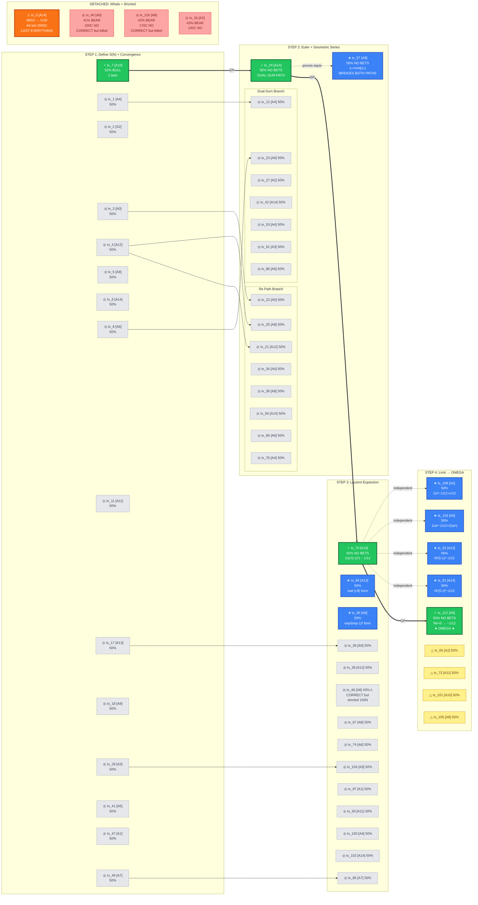
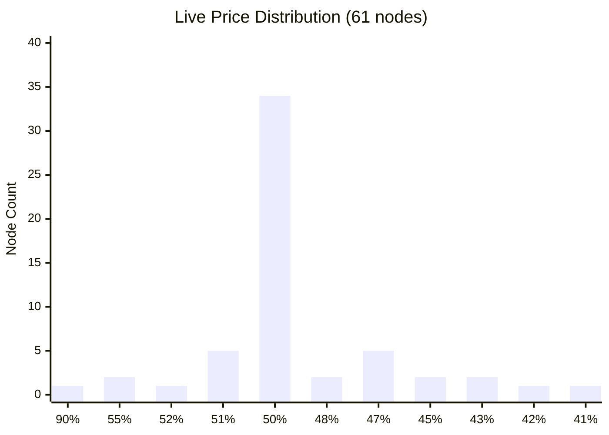
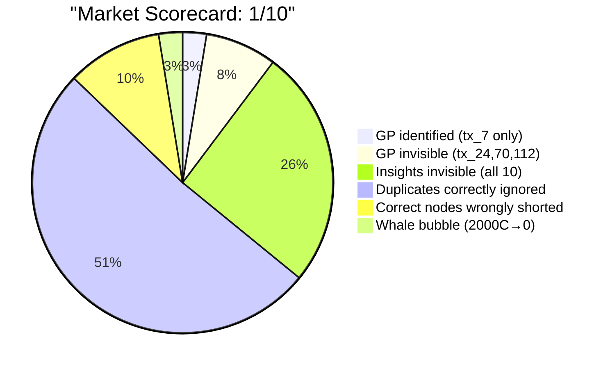

# Zeta Sum Proof Run 11 — Visualized DAG

**61 nodes | 4 GP | 10 Insights | 42 Duplicates | 4 Partials | 1 Whale | 0 Errors**

Color key: 🟢 GP (settled 1.00) | 🔵 Insight (valuable, not GP) | ⬜ Duplicate | 🟡 Partial | 🔴 Error | 🟠 Whale

## Golden Path + Insights + Key Traded Nodes

## Market Price Distribution

## Market Scorecard

