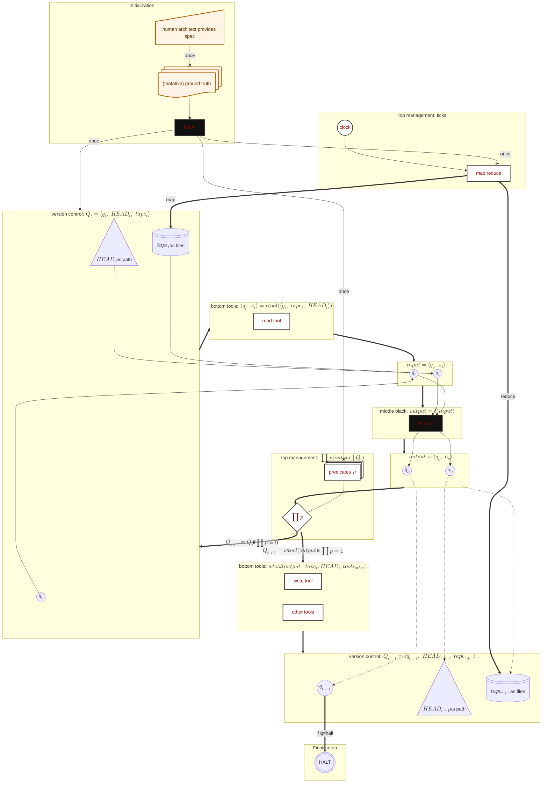

```mermaid
flowchart TD
      classDef white fill:#fff,stroke:#333,stroke-width:2px,color:#900
      classDef black fill:#111,stroke:#333,stroke-width:2px,color:#900
      classDef human fill:#fff4e6,stroke:#a85d00,stroke-width:2px,color:#5c3200
      classDef note fill:#fff8cc,stroke:#8a6d00,stroke-width:1px,color:#4d3d00

      subgraph Initialization
	      human:::human@{ shape: sl-rect, label: "human architect provides spec" }
	      law:::human@{ shape: docs, label: "(tentative) ground truth"}
	      initAI[Init AI]:::black
	    end
	    
	    subgraph Finalization
		  halt@{ shape: dbl-circ, label: "HALT" }
		    
	    end

      subgraph Q0["version control:   $$~ Q_t = \langle q_t,\ HEAD_t,\ tape_t \rangle$$"]
          q0(("$$q_t$$"))
          HEAD0@{ shape: tri, label: "$$HEAD_t$$<br> as path" }
          tape0@{ shape: lin-cyl, label: "$$tape_t$$<br> as files" }
      end

      subgraph Q1["version control:   $$~ Q_{t+1} = \langle q_{t+1},\ HEAD_{t+1},\ tape_{t+1}\rangle$$"]
          q1(("$$q_{t+1}$$"))
          HEAD1@{ shape: tri, label: "$$HEAD_{t+1}$$ <br> as path" }
          tape1@{ shape: lin-cyl, label: "$$tape_{t+1}$$<br> as files" }
      end

      subgraph rtool["bottom tools: $$~ \langle q_i,\ s_i \rangle = \mathbf{rtool}(\langle q_t,\ tape_t,\ HEAD_t \rangle)$$"]
          r["read tool"]:::white
      end 
      
      subgraph input["$$~ input = \langle q_i,\ s_i \rangle$$"]
          qi(("$$q_i$$"))
          si(("$$s_i$$"))
      end

      subgraph AI["middle black: $$~ output= \delta(input)$$"]
          delta["AI as $$~\delta$$"]:::black
          
      end
      


      subgraph output["$$~ output = \langle q_o,\ a_o \rangle$$"]
          qo(("$$q_o$$"))
          ao(("$$a_o$$"))
      end

      subgraph top["top management:   $$~ \prod \mathbf{p}(output \mid Q_t)$$"]
          
          predicates:::white@{ shape: processes, label: "predicates $$~p$$" }
          p{"$$\prod \mathbf{p}$$"}:::white

          
      end
      subgraph toptick["top management: ticks "]

          mr["map reduce"]:::white
          clock(("clock")):::white

      end
      


      

      subgraph wtool["bottom tools: $$~ \mathbf{wtool}(output \mid tape_t,HEAD_t,tools_{other})$$"]
          w["write tool"]:::white
		      tools["other tools"]:::white

      end


%%init
      human --x| once| law      
      law --> initAI
      initAI --x | once| predicates
      predicates---p
      initAI --x | once| mr
      initAI --x | once| Q0
      
%%loop
      tape0 & HEAD0 ----> si
      
      q0 --> qi

      qi & si --> delta

      delta --> qo & ao
      
      qo -.-> q1
      ao -.-> HEAD1
      ao -.-> tape1

%% macro

      Q0 ==> rtool ==> input ==> AI ==> output ==> p
      p ==>|"$$Q_{t+1} = \mathbf{wtool}( output )$$ <br>if $$\prod \mathbf{p} = 1$$"| wtool ==> Q1 
      p ==>|"$$Q_{t+1} = Q_t$$<br>if $$\prod \mathbf{p} = 0$$"| Q0
			q1 ==> |"if q=halt"| halt
%% map reduce
			clock --> mr			
			mr ==>|map| tape0
			mr ==>|reduce| tape1
```